# LifeVibe Blog Platform - Architecture Diagram

## System Architecture Overview


## Detailed Component Architecture

```mermaid
graph LR
    subgraph "Frontend Components"
        F1[App.jsx]
        F2[AdminContext]
        F3[Router]
        
        F1 --> F2
        F1 --> F3
        
        F3 --> P1[Home Page]
        F3 --> P2[PostDetail Page]
        F3 --> P3[AddPost Page]
        F3 --> P4[EditPost Page]
        F3 --> P5[AdminLogin Page]
        
        P1 --> C1[PostList Component]
        C1 --> C2[PostCard Component]
        
        F1 --> N1[Navbar Component]
        F1 --> F1[Footer Component]
    end
    
    subgraph "Backend Structure"
        S1[server.js]
        S1 --> R1[/posts routes]
        S1 --> R2[/api/admin routes]
        
        R1 --> PC[PostController]
        R2 --> AC[AdminController]
        
        PC --> PM[Post Model]
        AC --> AUTH[JWT Auth]
        
        R1 --> MW[Auth Middleware]
    end
```

## API Data Flow Diagram


## Database Schema Diagram


## Authentication Flow


## Technology Stack


## File Structure Overview


## Security Architecture


## Deployment Architecture (Recommended)

```mermaid
graph TB
    subgraph "Production Environment"
        LB[Load Balancer]
        
        subgraph "Frontend Deployment"
            CDN[CDN/Static Hosting]
            CDN --> REACT[React Build]
        end
        
        subgraph "Backend Deployment"
            SERVER[Node.js Server]
            SERVER --> API[Express API]
        end
        
        subgraph "Database"
            MONGO[MongoDB Atlas/Cloud]
        end
        
        subgraph "Environment Variables"
            ENV[.env File]
            ENV --> MONGO_URI[MONGO_URI]
            ENV --> JWT_SECRET[JWT_SECRET]
            ENV --> PORT[PORT]
        end
    end
    
    LB --> CDN
    LB --> SERVER
    SERVER --> MONGO
    SERVER -.->|Reads| ENV
```



---

## Architecture Summary

This LifeVibe blog platform follows a **3-tier architecture**:

1. **Presentation Layer**: React frontend with Bootstrap styling
2. **Application Layer**: Express.js REST API with JWT authentication
3. **Data Layer**: MongoDB with Mongoose ODM

### Key Features:
- ✅ **RESTful API Design**
- ✅ **JWT-based Authentication**
- ✅ **Protected Admin Routes**
- ✅ **Responsive UI Components**
- ✅ **MongoDB Integration**
- ✅ **CORS-enabled Backend**
- ✅ **Modern React with Hooks**
- ✅ **Category-based Content Organization**